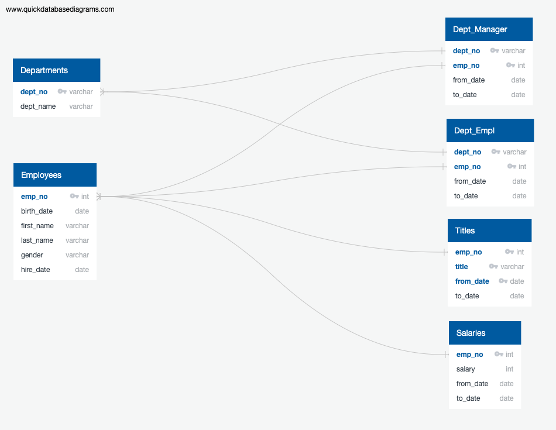

# Pewlett Hackard Staffing Analysis
## Overview

To aid the HR department and senior management of Pewlett Hackard (PH), this project was initiated to determine the volume of employees that are eligible for retirement in the upcoming years as to forecast the hiring and training requirements of the company.  The goal is to give a clear understanding of the current situation to help develop a strategy for management of staffing needs for the future.  This analysis looked at files containing the personnel information from all divisions throughout the company with a breakdown of the number of employees that are reaching retirement by job title.  Additionally, the number of retirement age employees that are eligible to become mentors for the roles within the company were identified to give an impression of the company's capacity to manage the upcoming surge in retirements.  With this data in hand a clear picture of the current state and future needs can be determined.

---
## Results

To analyze the employee data to determine the number of retirement eligible employees and mentor candidates for PH, the data was parsed using [queries](/Queries/Employee_Database_challenge.sql) in postgreSQL organize the data sets presented and allow queries on the datasets to be completed to extract the pertinent data. For this analysis it was important to separate the employees by the criteria that indicates that they are eligible for retirement to determine the number of employees that are expected to retire soon and the employees that were eligible to become mentors, both based on their age and title. This data was organized within the database according to the entity relationship diagram (ERD) shown below:

1. Retirement Candidates
  - To determent the candidates eligible for retirement, all employees within the company were selected that had a birthdate in the years between 1952-1955.  This created a table containing all employee in this range along with their title and start and to date. This table makes it possible to do further analysis within this group of employees.   

2. Retirement Candidates by Title
  - The query of the retirement employees for PH shows a significant number of engineer and senior staff are at the retirement age. The breakdown of the retirement eligible employees using postgreSQL show the number of employees by job title in this group in the chart below with the total employees in this group.

| Total Retirement Age Employees | Total Employees |
|:-------------------------:|:-------------------------:|
|  |   |
 

                 

   - When compared to the current number of employees within the company eligible for retirement, it illustrates significant number of the employees eligible for retirement.

3. Mentorship Candidates
  -To help develop the employees that will replace the large group of retirement employees within the company, it was important to identify the number of mature employees that are eligible for mentoring junior employees to give them the skills to minimize the impact of the large number of eligible retirees within the company.  To do this the employees that are just entering the retirement age range were isolated by selecting employees that have a birthdate in 1965.  This provided as list of likely candidates that can be incorporated into the mentorship program.
  
4. Mentorship Candidates by Title
  -To see how the pool of mentorship eligible candidates compared to number of retirement employees the mentorship candidates were grouped by title to allow for a direct comparison. 

| Eligible Mentorship Candidates | Total Retirement Age Employees |
|:-------------------------:|:-------------------------:|
|  |  |

  - As seen in the charts above the total mentorship candidates is significantly lower than the total eligible retirees.  This discrepancy is seen across all job titles and notably none are available for management roles within the organization.

### Additional Analysis

To create a clearer view of the situation within the company, [code](/Data/Data_analysis/PH_retirement_mentorship_analysis.ipynb) was developed for the visualization of the date collected using JuypterLab and matplotlib to create graphs showing the number of employees in all three groups: current employees, retirement eligible, and mentorship eligible.  This allows for a clear visualization of the large volume of retirement eligible employees within this group and the low number of eligible mentors.

Looking at the graph and tables created for this analysis, there were some anomalies observed based on the initial selection protocol for the selection of retirement eligible employees. In the first two tables we can see that the group of senior staff within the selection group that is eligible for retirement is greater than the total number of current employees in this role.  Looking at the analysis it was evident that the list of data contained employees that have a to date that was before the current date.  This could indicate that these employees are already retired or have left the company.  To remedy this another analysis was completed which only included active employees.

After completing the new analysis new tables containing the revised number of retirement eligible staff was obtained and could be compared to the other two data sets.  To do this a new chart and set of tables were created to show the data.  From this it shows that the number of eligible retirement candidates are reduced but that there is still a significant number in comparison to the total employees within this group.

| Total Current Retirement Age Employees | Total Employees | Total Mentorship |
|:-------------------------:|:-------------------------:|:-------------------------:|
|  |   |  |

---

## Summary
Based on this analysis it is evident that there is a significant number of employees eligible for retirement in the senior staffing group. This will place a large burden on the younger staff to meet the needs of these positions as the individuals leave these roles.  To ensure that there is a smooth transition it is important that their an adequate number of senior staff that can act as mentors for the younger staff and train them to adequately manage the roles that will come available in the future.  Based on the current criteria for eligibility for the mentorship program the number of mentors is greatly lower than the number of potential retirees.  As the selection is based on the birthdate of the employee a possible remedy to this issue is to broaden this criterion to increase the number of potential mentors from this group.  To illustrate this the selection criteria for mentors was increased to include employees with birthdates between 1963 to 1965.  The analysis was completed with these new parameters which reduced the discrepancy between the number of eligible retirees and the eligible mentors.  This is illustrated in the tables and chart below.

| Total Current Retirement Age Employees | Total Employees | Total Expanded Mentorship |
|:-------------------------:|:-------------------------:|:-------------------------:|
|  |   |  |

With this larger group of eligible mentors, the impact of the retirement of senior staff could be reduced which will could have a positive impact on the productivity moving forward. Additional information that may of interest to do further analysis on is on the other group of employees that are not in the retirement range to determine the number of employees by title and determine if there is adequate numbers of employees from each group to fill potential roles as needed in the future.

---

